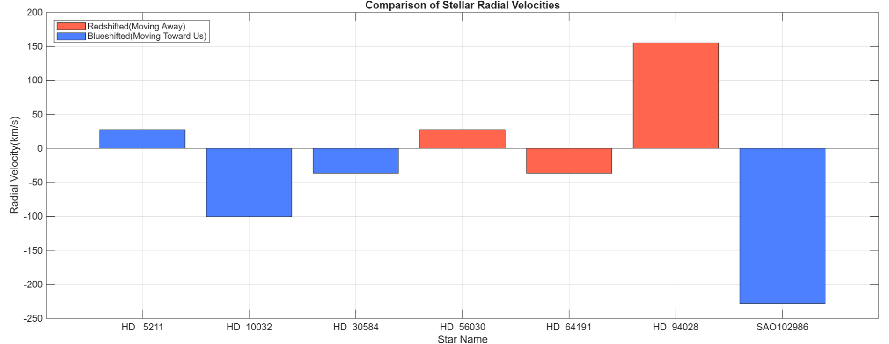
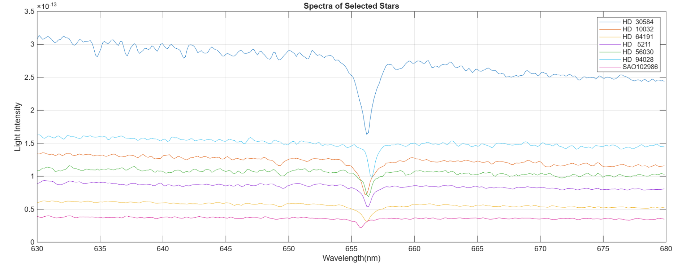
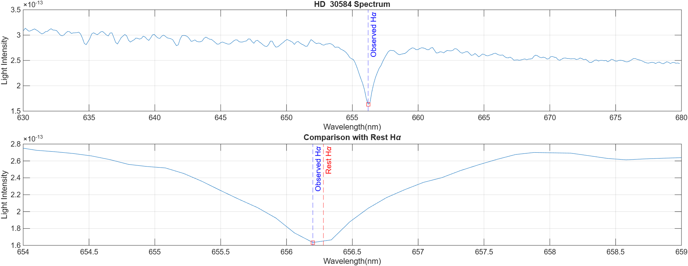
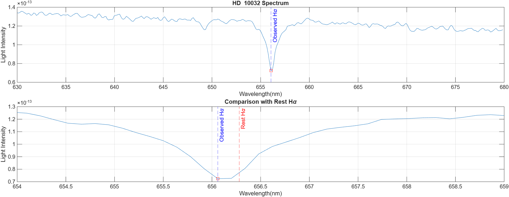
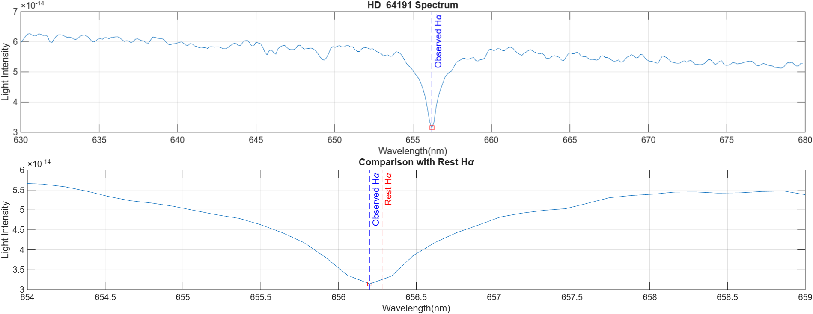
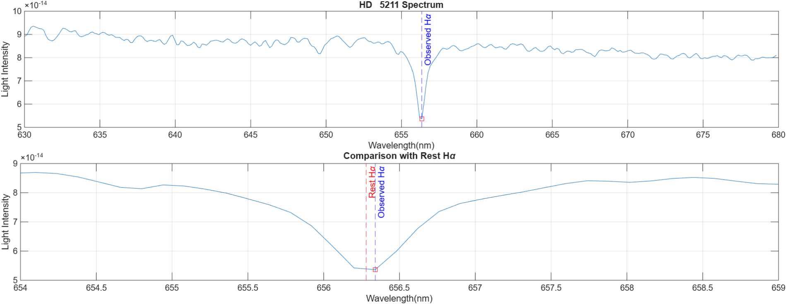
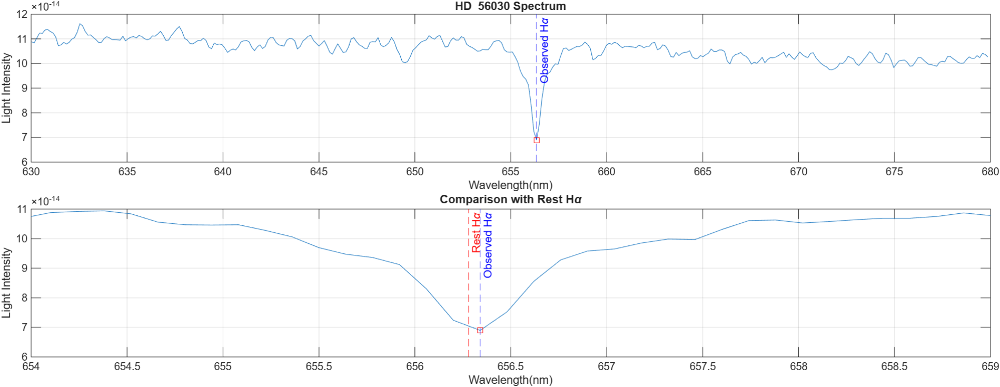
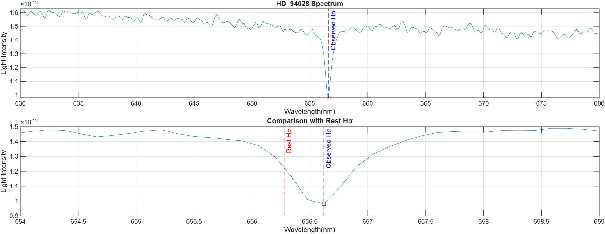
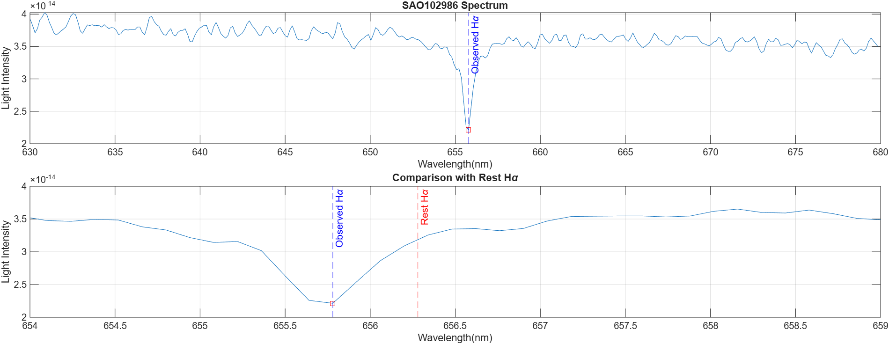

# Stellar Radial Velocity Estimation

A MATLAB pipeline for estimating stellar radial velocities from spectroscopic observations using the Doppler effect applied to the H-alpha absorption line.

---

## Table of Contents

- [Overview](#overview)
- [Background](#background)
- [Results](#results)
- [Project Structure](#project-structure)
- [Requirements](#requirements)
- [Getting Started](#getting-started)
- [How It Works](#how-it-works)
- [Output Figures](#output-figures)
- [Stars Analyzed](#stars-analyzed)
- [License](#license)

---

## Overview

This project implements a MATLAB pipeline for estimating stellar radial velocities from spectral observations. Using the Doppler effect, the observed wavelength of the H-alpha absorption line is compared with its rest wavelength (656.28 nm) to determine the motion of stars relative to Earth.

The pipeline:
- Processes raw spectral data for seven stars across the 630–680 nm wavelength range
- Identifies and localizes the H-alpha absorption line minimum for each star
- Calculates radial velocity from the measured Doppler shift
- Classifies each star as **approaching** (blueshifted) or **receding** (redshifted)
- Produces spectral plots, H-alpha comparison subplots, and a comparative velocity bar chart

---

## Background

### The Doppler Effect in Stellar Spectroscopy

When a star moves toward or away from an observer, the light it emits is compressed or stretched. This shifts all spectral features to shorter (blue) or longer (red) wavelengths respectively.

The **H-alpha line** (rest wavelength λ₀ = 656.28 nm) is a prominent hydrogen absorption feature used as a reference because it is strong and easily identifiable in stellar spectra.

### Radial Velocity Formula

The radial velocity is derived from the non-relativistic Doppler relation:

$$v_r = \frac{\lambda_{\text{obs}} - \lambda_0}{\lambda_0} \cdot c$$

Where:
- $v_r$ — radial velocity (km/s)
- $\lambda_{\text{obs}}$ — observed H-alpha wavelength (nm)
- $\lambda_0$ — rest H-alpha wavelength = 656.28 nm
- $c$ — speed of light = 299,792.458 km/s

| Shift | Direction | Sign of $v_r$ |
|-------|-----------|---------------|
| Redshift | Moving **away** from Earth | Positive (+) |
| Blueshift | Moving **toward** Earth | Negative (−) |

---

## Results

### Radial Velocity Summary

| Star Name | Radial Velocity (km/s) | H-alpha Wavelength (nm)  |    Shift    |
|-----------|------------------------|--------------------------|-------------|
| HD 30584  | −36.544                | 656.20                   | Blueshifted |
| HD 10032  | −100.5                 | 656.06                   | Blueshifted |
| HD 64191  | −36.544                | 656.20                   | Blueshifted |
| HD 5211   | +27.408                | 656.34                   | Redshifted  |
| HD 56030  | +27.408                | 656.34                   | Redshifted  |
| HD 94028  | +155.31                | 656.62                   | Redshifted  |
| SAO102986 | −228.4                 | 655.78                   | Blueshifted |

### Radial Velocity Comparison



- **SAO102986** has the highest approach speed (~228 km/s)
- **HD 94028** has the highest recession speed (~155 km/s)

---

## Project Structure

```
stellar-radial-velocity-estimation/
│
├── README.md
├── LICENSE
├── .gitignore
│
├── src/
│   └── stellar_radial_velocity_estimation.m   # Main MATLAB script
│
├── data/
│   └── starData.mat                            # Spectral data for 7 stars
│
└── figures/
    ├── all_stellar_spectra.png                 # Overlay of all 7 spectra
    ├── HD30584_halpha.png                      # H-alpha analysis: HD 30584
    ├── HD10032_halpha.png                      # H-alpha analysis: HD 10032
    ├── HD64191_halpha.png                      # H-alpha analysis: HD 64191
    ├── HD5211_halpha.png                       # H-alpha analysis: HD 5211
    ├── HD56030_halpha.png                      # H-alpha analysis: HD 56030
    ├── HD94028_halpha.png                      # H-alpha analysis: HD 94028
    ├── SAO102986_halpha.png                    # H-alpha analysis: SAO102986
    ├── radial_velocity_comparison.png          # Bar chart of all velocities
   
```

---

## Requirements

- **MATLAB** R2019b or later (uses `xline`, `categorical`, and `bar` with table input)
- No additional toolboxes required

---

## Getting Started

### 1. Clone the repository

```bash
git clone https://github.com/your-username/stellar-radial-velocity-estimation.git
cd stellar-radial-velocity-estimation
```

### 2. Open MATLAB and set the path

In MATLAB, navigate to the project root or add it to your path:

```matlab
addpath('src')
addpath('data')
```

### 3. Run the script

```matlab
cd src
stellar_radial_velocity_estimation
```

Make sure `starData.mat` is on the MATLAB path or in the working directory before running. The script calls `load starData` at the top.

---

## How It Works

### Step 1 — Load Data

```matlab
load starData
```

The `starData.mat` file contains:
- `spectra` — an `N × 7` matrix of light intensity values (one column per star)
- `starnames` — a `1 × 7` string array of star identifiers

### Step 2 — Build the Wavelength Axis

The wavelength axis is reconstructed from the dataset metadata:

```matlab
lambdaStart = 630.02;   % nm
lambdaDelta = 0.14;     % nm per sample
lambda = lambdaStart : lambdaDelta : lambdaEnd;
```

This gives a wavelength range of approximately **630–680 nm**.

### Step 3 — Plot All Spectra

All seven spectra are overlaid on a single figure for comparison, showing relative brightness and the prominent H-alpha absorption dip near 656 nm.

### Step 4 — Detect H-alpha Minimum

For each star, the spectrum is searched in the **654–658 nm** window, and the wavelength at minimum intensity is taken as the observed H-alpha position:

```matlab
region = (lambda > 654) & (lambda < 658);
[sHa, idx] = min(sRegion);
lambdaHaObs = lambdaRegion(idx);
```

### Step 5 — Compute Radial Velocity

```matlab
lambdaShift = (lambdaHaObs / lambdaHa) - 1;
radialVelocity = lambdaShift * c;   % in km/s
```

### Step 6 — Classify and Visualize

Each star is classified as **Redshifted** (receding) or **Blueshifted** (approaching) and the results are displayed as a color-coded bar chart and printed summary table.

---

## Output Figures

### All Stellar Spectra



### Individual H-alpha Analyses

Each star gets a two-panel subplot:
- **Top panel** — full spectrum (630–680 nm) with observed H-alpha marked
- **Bottom panel** — zoomed H-alpha region (654–659 nm) comparing observed vs. rest wavelength

| Star | H-alpha Plot |
|------------|----------------------------------------|
| HD 30584   |  |
| HD 10032   |  |
| HD 64191   |  |
| HD 5211    |    |
| HD 56030   |  |
| HD 94028   |  |
| SAO102986  |  |

---

## Stars Analyzed

| Star | Catalog | Notes |
|------|---------|-------|
| HD 30584  | Henry Draper Catalog | Blueshifted; moderate approach |
| HD 10032  | Henry Draper Catalog | Blueshifted; fast approach |
| HD 64191  | Henry Draper Catalog | Blueshifted; same shift as HD 30584 |
| HD 5211   | Henry Draper Catalog | Redshifted; slow recession |
| HD 56030  | Henry Draper Catalog | Redshifted; same shift as HD 5211 |
| HD 94028  | Henry Draper Catalog | Redshifted; high recession velocity |
| SAO102986 | SAO Star Catalog     | Blueshifted; highest velocity in sample |

---

## License

This project is licensed under the **Apache License 2.0**. See [LICENSE](LICENSE) for full details.
